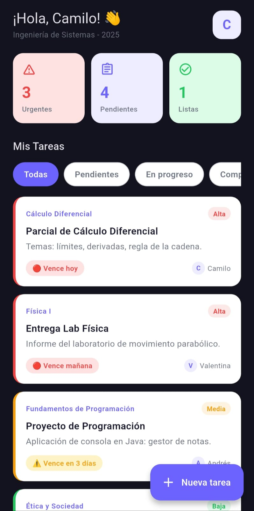
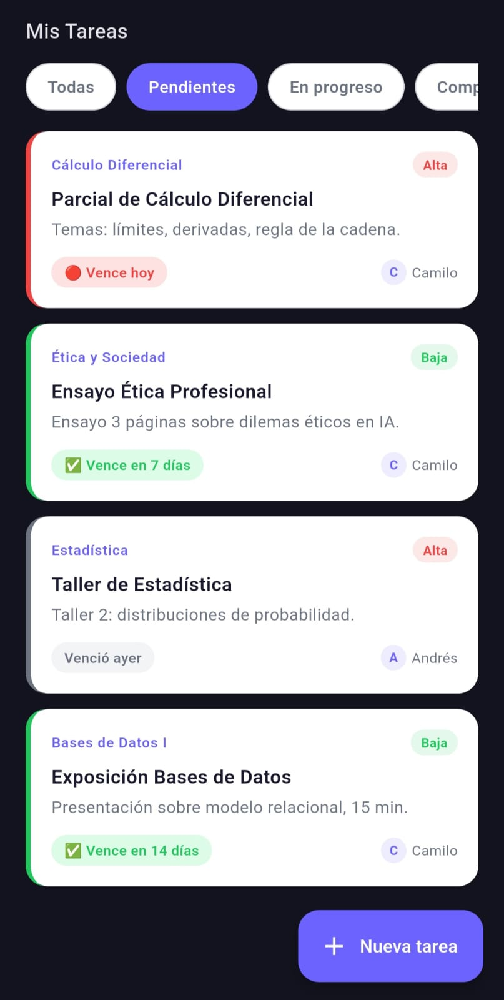
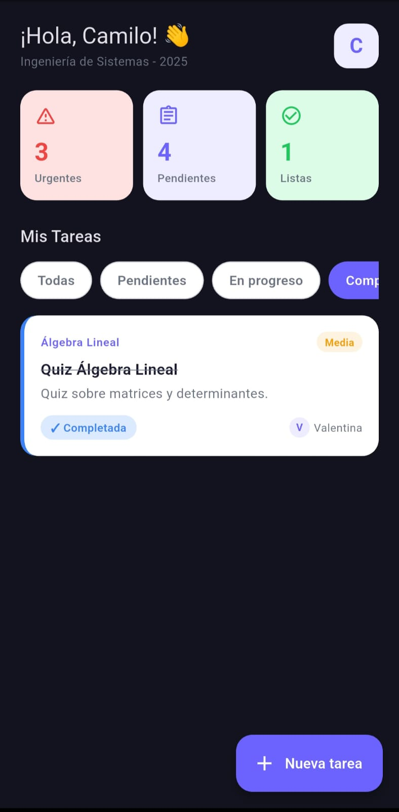

# 🚀 StudentFlow

StudentFlow es una herramienta integral diseñada para que los estudiantes universitarios  
organicen sus horarios, tareas y calificaciones en un solo lugar.

## 📸 Capturas de pantalla  

| Pantalla de Inicio | Pendientes | Completadas |
| :---: | :---: | :---: |
|  |  |  |

## 🛠️ Tecnologías utilizadas
* Flutter - Framework de desarrollo multiplataforma
* Dart - Lenguaje de programación
* Firebase - Backend y base de datos en tiempo real

## 📋 Roadmap (Plan de trabajo)

### Semana 1 : Diseño(UI/UX)  
* Meta: Que la app se vea bien aunque los datos sean "de mentira
* Tareas:
    * Configurar el proyecto en flutter
    * Crear el modelo de Datos(Tarea y Grupo)
    * Diseñar la pantalla de inicio y tarjetas de tarea
    * Crear la logica de colores automaticos (la app debe pintar de rojo lo que venceria mañana)
* Entregable: Una app que abres y muestra una lista de tareas de ejemplo con colores

### Semana 2: Navegacion
* Meta: Que la app recuerde quien eres y te permita moverte entre pantallas
* Tareas:
    * Crear la pantalla de Binevenida(Crear grupo / Unirse a grupo)
    * Implementar shared_preferences para guardar el nombre del usuario y el ID de su grupo en el movil
    * Diseñar el formulario de registro de tareas
* Entregable: Una app que, si la cierras y la abres recuerda tu nombre y te lleva directo a tu agenda vacia

### Semana 3: Nube(Firebase)
* Meta: Que la app sea online y compartida
* Tareas:
    * Vincular el proyecto con firebase
    * Crear la base de datos 
    * programar la función para subir una tarea a la nube
    * Programar el stream para que cuando tu amigo suba una tarea te aparesca a ti al instante
* Entregable: Escribes en un celular y aparece en el otro

### Semana 4: Detalles
* Meta: Compartir el grupo y mejorar la experiencia
* Tareas:
    * Implementar share_plus para enviar el codigo del grupo por whatsapp
    * Agregar la logica de borrar o editar tareas (solo si tu las creaste o para todos)
    * Añadir iconos dinamicos
    * Configurar modo oscuro
* Entregable: Una app funcional que ya puedes pasarle a tus compañeros de clase

### Semana 5: Notificaciones
* Meta: Que nadie olvide fechas importantes de la U
* Tareas:
    * Configurar avisos basicos
    * limpiar el codigo (borrar comentarios innecesarios)
    * generar el archivo apk
* Entregable: Apk funcional 

## 📁 Estructura del Proyecto (lib/)

lib/  
├─ core/  
├─ data/  
├─ features/  
├─ shared/  
├─ main.dart  
├─ app.dart  

* core/ — Todo lo reutilizable(colores, textos, tema)
* data/ — Separa los modelos de los repositorios
* features/ — Cada funcionalidad es autónoma
* shared/ — Widgets genéricos que usan mucho  

#
Desarrollado con ❤️ por Camilo